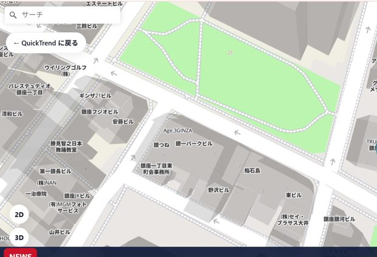
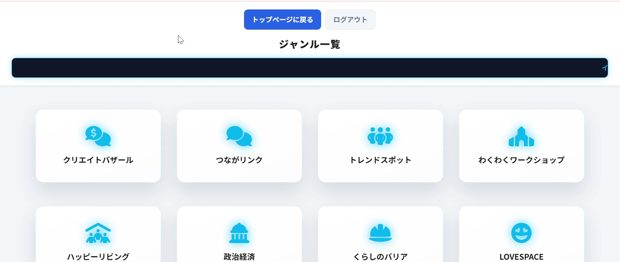

<div align="center">

# QuickTrend

**A location-based social platform where your city becomes the feed.**

Share and discover local, real-time information on an interactive map — vote on places, see what is trending near you, and chat in topic-based rooms.

[](LICENSE)
[](CONTRIBUTING.md)
[](https://github.com/gfhajkafjhdfk/QuickTrend-of-backup/issues?q=is%3Aissue+is%3Aopen+label%3A%22good+first+issue%22)
[](#about)

[**Live Demo**](https://gfhajkafjhdfk.github.io/QuickTrend-of-backup/) · [Report a Bug](../../issues/new?template=bug_report.yml) · [Request a Feature](../../issues/new?template=feature_request.yml) · [Contributing](CONTRIBUTING.md)



</div>

---

## Why QuickTrend?

> **"There is a lot of local information, but much of it never reaches the people who need it."**

Most social apps flatten *where* things happen. QuickTrend is built the other way around: the **map is the timeline**. Spots light up as people vote and post, so a neighbourhood's real-time mood becomes something you can *see*. The goal is to make local communication more accessible and to help solve the shortage of community connection in a place.

## Features

- 📍 **Map-first feed** — posts and popularity are visualised directly on an interactive map
- 🗳 **Vote on places** — tap a spot to vote; the map re-renders the collective answer
- 💬 **Topic-based chat rooms** — genre-separated rooms (e.g. events, food, local life)
- ⚡ **Real-time updates** — see local activity as it happens
- 🌗 **Day / night & 2D / 3D map modes**
- 🔐 **Security-conscious** — hashed passwords, CSRF protection, rate limiting, user-enumeration hardening

## Screenshots

| Interactive map | Topic rooms |
| :--: | :--: |
|  |  |

## Tech Stack

| Layer | Technology |
| --- | --- |
| Frontend | HTML / CSS / JavaScript, [Mapbox GL JS](https://www.mapbox.com/), [Turf.js](https://turfjs.org/) |
| Backend | PHP 8.3 (FPM) |
| Database | MySQL 8.0 |
| Web server | Nginx |
| Infra / CI | Linux VPS, GitHub Actions (rsync deploy over SSH) |

## Getting Started (Local Development)

> Requires **PHP 8.1+**, **MySQL 8.0+**, and a web server (PHP's built-in server is fine for a quick look).

```bash
# 1. Clone
git clone https://github.com/gfhajkafjhdfk/QuickTrend-of-backup.git
cd QuickTrend-of-backup

# 2. Create the database (schema only — no data is shipped)
mysql -u root -p < database.sql
# optional: load a dev test user
mysql -u root -p quicktrend < database.seed.dev.sql

# 3. Backend config (never committed — see .gitignore)
cp php/config.local.php.example php/config.local.php   # then edit DB credentials
#   (or set the QT_DB_* environment variables instead)

# 4. Frontend config: set your own Mapbox token
cp js/config.example.js js/config.local.js             # then paste a domain-restricted pk. token

# 5. Run
php -S localhost:8000                                  # then open http://localhost:8000
```

> 🔑 **Mapbox token:** use your own **publishable (`pk.`) token** and restrict it to your domain in the [Mapbox dashboard](https://account.mapbox.com/). Never commit it — `js/config.local.js` is git-ignored.

## Project Structure

```
├── index.html            # Landing
├── Map.html              # Interactive map (Mapbox GL)
├── QuickTrend.html       # Main app shell
├── php/                  # Auth, API, chat, matching (server-side)
├── js/                   # Frontend logic (js/map/* = map modules)
├── database.sql          # Schema (no real data)
├── .github/workflows/    # CI/CD (deploy, CodeQL)
└── docs/                 # Screenshots & docs
```

## Roadmap

- [ ] Improve UI/UX and mobile optimisation
- [ ] Enhanced search & filtering
- [ ] AI-assisted local information analysis
- [ ] Community moderation features
- [ ] English UI / i18n

See the [open issues](../../issues) and the [`good first issue`](../../issues?q=is%3Aissue+is%3Aopen+label%3A%22good+first+issue%22) label for ways to help.

## Contributing

Contributions of every size are welcome — from typo fixes to new features. Start with **[CONTRIBUTING.md](CONTRIBUTING.md)** and look for the [`good first issue`](../../issues?q=is%3Aissue+is%3Aopen+label%3A%22good+first+issue%22) label. Please also read our [Code of Conduct](CODE_OF_CONDUCT.md).

Found a security issue? Please **do not** open a public issue — see [SECURITY.md](SECURITY.md).

## About

Built by a Japanese high-school student as a long-term project to learn full-stack development while making something with real social impact. Feedback, suggestions, and pull requests are genuinely appreciated.

## License

Released under the [MIT License](LICENSE).
